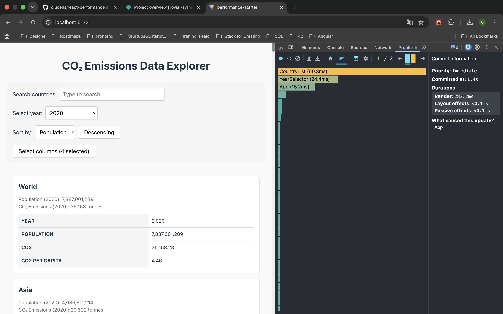
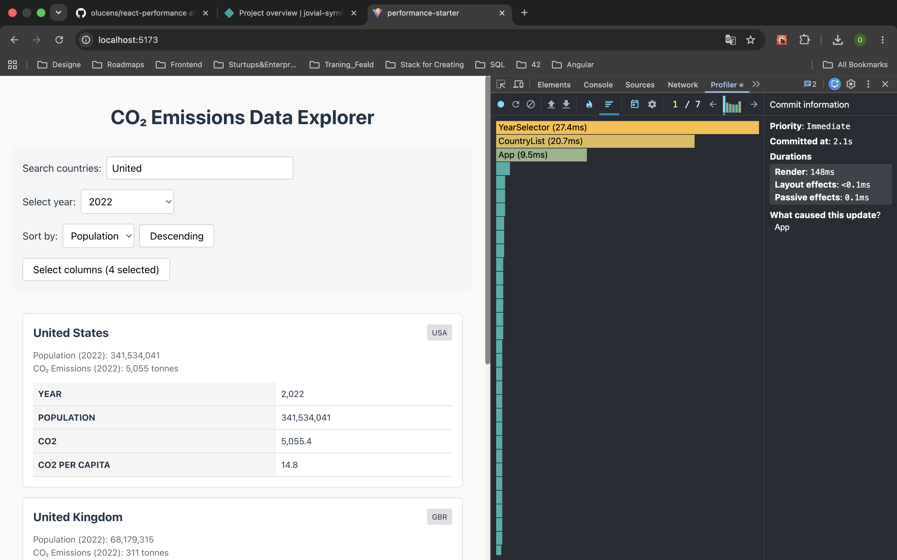
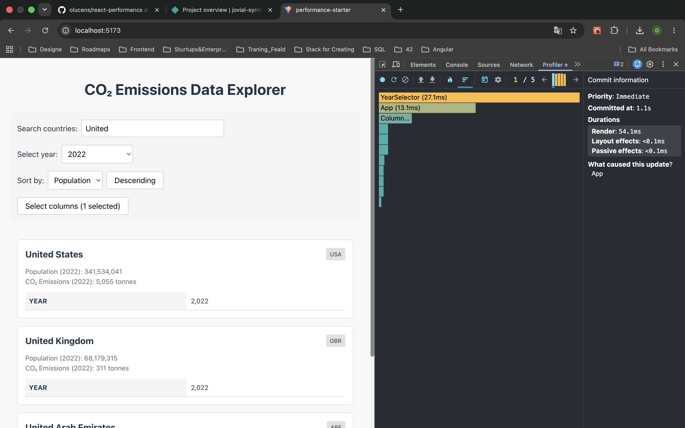
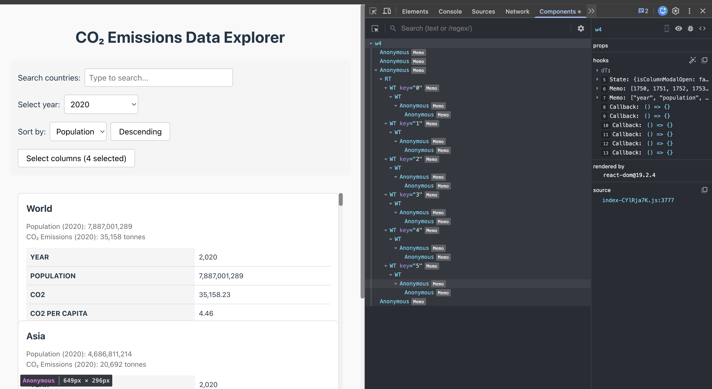
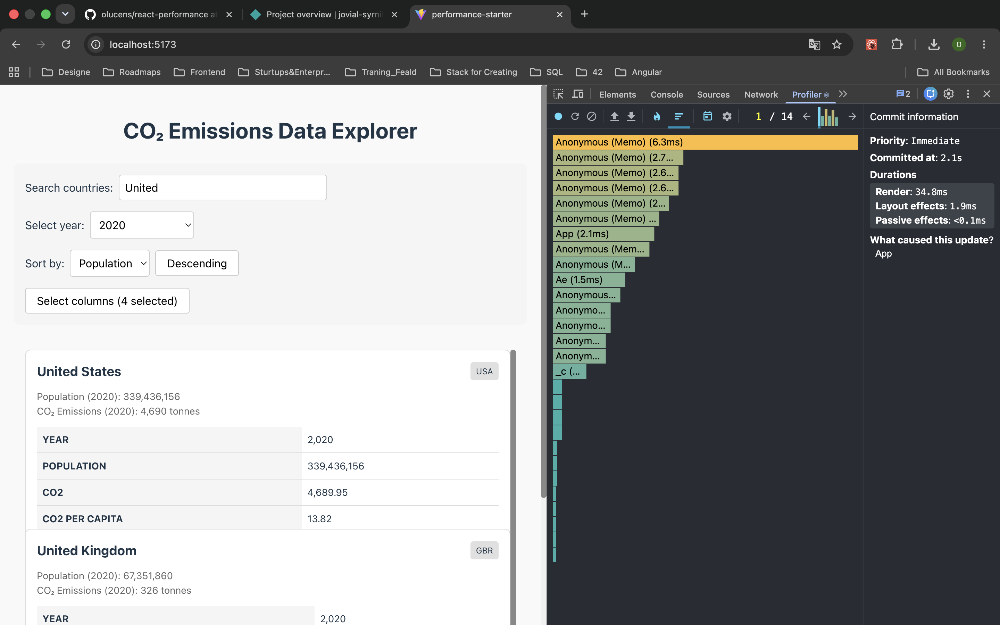
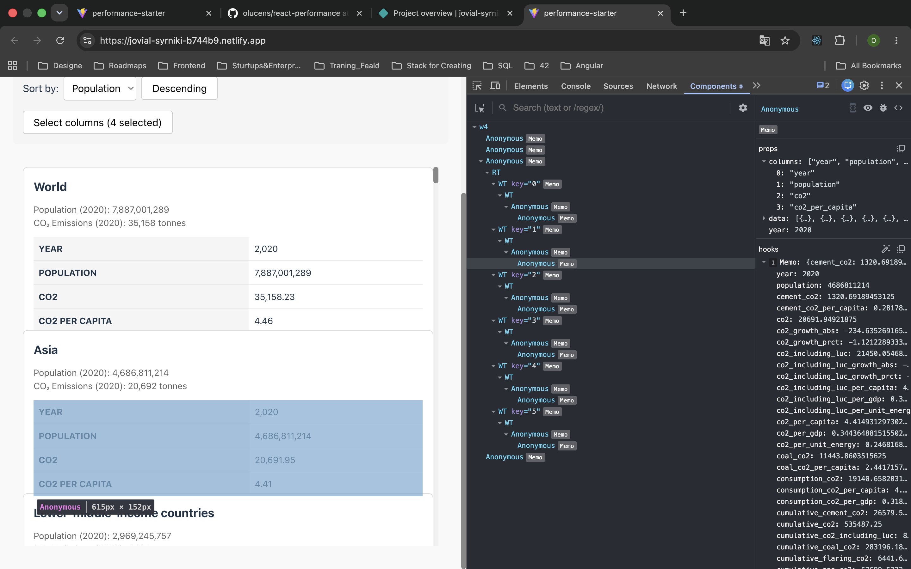
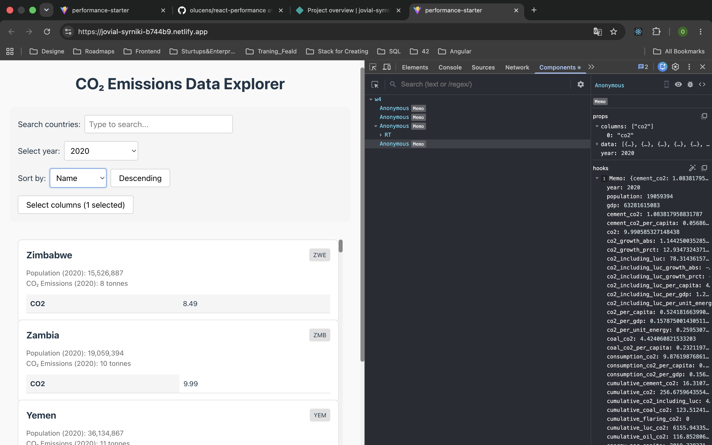

# Performance Optimization Report

CO₂ Emissions Data Explorer — profiling the intentionally unoptimized starter and
measuring the impact of React optimization techniques. All measurements were captured
with the React DevTools Profiler in development mode (`npm run dev`), one interaction per
recording. Screenshots are stored under [`screenshots/`](./screenshots/).

---

## Methodology

- **Build mode:** development (`npm run dev`) — per task requirement, for accurate
  component-level timing.
- **Tool:** React DevTools **Profiler** tab. `react-scan` (see
  [`src/main.tsx`](./src/main.tsx)) can be enabled (`enabled: true`) to visualize
  re-renders while profiling.
- **Dataset:** `public/data/owid-co2-data.json` (~200+ countries, each with decades of
  yearly records).
- **Process:** each interaction recorded in its own session — Start profiling → perform
  the single interaction → Stop profiling → read the commit metrics and inspect the flame
  chart.
- **Metrics captured per interaction:**
  - **Render duration** — time React spent rendering components for that commit. This is
    the primary performance metric (the commit duration is effectively the same here, as
    layout/passive effects measured `<0.1 ms`).
  - **Committed at** — timestamp of the commit within the recording (shown by the
    Profiler); kept for traceability against each screenshot, not as a speed metric.
  - **Flame chart** — which components rendered and how long each took.

---

## Baseline Measurements (unoptimized)

> Recorded before any optimization. Screenshots in
> [`screenshots/baseline/`](./screenshots/baseline/).

### Interaction A: Sort countries

- **Committed at**: 1,4 s
- **Render duration**: 283,2 ms
- **Screenshot**: 

### Interaction B: Search countries (type "United")

- **Committed at**: 2,1 s
- **Render duration**: 148 ms
- **Screenshot**: 

### Interaction C: Change year

- **Committed at**: 2,6 s
- **Render duration**: 291,2 ms
- **Screenshot**: 

### Interaction D: Toggle column

- **Committed at**: 1,1 s
- **Render duration**: 54,1 ms
- **Screenshot**: 

### Baseline bottlenecks observed

The starter renders **every** country (200+) and, inside each card, the full data table
on every keystroke / sort / year change. The flame charts confirm:

- `CountryList` dominates every commit (60,3 ms on sort, 57,4 ms on year change) — the
  entire `CountryList → CountryCard → DataTable` subtree re-renders on any state change,
  because no component is memoized and handlers are recreated each render.
- `createYearDataMap` was rebuilt repeatedly (and originally called inside the sort
  comparator, i.e. once per comparison — O(n log n) map builds).
- The whole list is mounted in the DOM at once, so commit duration scales with the full
  dataset rather than with what is visible.

---

## Optimized Measurements

> Recorded after applying the optimizations described below. Screenshots in
> [`screenshots/optimized/`](./screenshots/optimized/).

### Interaction A: Sort countries

- **Committed at**: 1,3 s
- **Render duration**: 15,9 ms
- **Screenshot**: 

### Interaction B: Search countries (type "United")

- **Committed at**: 2,1 s
- **Render duration**: 34,8 ms
- **Screenshot**: 

### Interaction C: Change year

- **Committed at**: 2,5 s
- **Render duration**: 37 ms
- **Screenshot**: 

### Interaction D: Toggle column

- **Committed at**: 1,3 s
- **Render duration**: 14,2 ms
- **Screenshot**: 

---

## Summary of Improvements

Values are **Render duration** (ms) read from the Profiler panel for each interaction;
`Improvement = (Baseline − Optimized) / Baseline × 100`.

| Interaction      | Baseline (ms) | Optimized (ms) | Improvement |
| ---------------- | ------------- | -------------- | ----------- |
| Sort countries   | 283,2         | 15,9           | 94,4%       |
| Search countries | 148           | 34,8           | 76,5%       |
| Change year      | 291,2         | 37             | 87,3%       |
| Toggle column    | 54,1          | 14,2           | 73,8%       |
| **Average**      | **194,1**     | **25,5**       | **86,9%**   |

---

## Optimizations Applied (Phase 2)

### 1. `useMemo` — memoized computed values

| Location | Memoized value | Why |
| -------- | -------------- | --- |
| [`app.tsx`](./src/components/app/app.tsx) | `getAvailableYears(data)`, `getAvailableColumns()` | Avoid recomputing derived lists on every render. |
| [`country-list.tsx`](./src/components/country-list/country-list.tsx) | `filteredCountries` (filter + sort) | The expensive part of the app — recomputed only when its inputs change. |
| [`country-card.tsx`](./src/components/country-card/country-card.tsx) | `createYearDataMap(country.data)` | Build the year→data map once per card instead of on every render. |
| [`data-table.tsx`](./src/components/data-table/data-table.tsx) | year `record` lookup | Avoid re-scanning the data array each render. |

A key fix: the sort comparator no longer calls `createYearDataMap` inside the comparison.
Population is pre-computed once per country, then sorted — turning O(n log n) map builds
into O(n).

### 2. `useCallback` — stable event handlers

All six handlers in [`app.tsx`](./src/components/app/app.tsx) (`handleSearch`,
`handleYearChange`, `handleSortFieldChange`, `handleSortOrderToggle`,
`handleColumnToggle`, `handleModalToggle`) are wrapped in `useCallback` with functional
`setState` updates. Stable identities mean the memoized children below don't re-render
just because `App` re-rendered.

### 3. `React.memo` — skip unnecessary re-renders

`SearchBar`, `YearSelector`, `ColumnModal`, `CountryList`, `CountryCard`, and `DataTable`
are wrapped in `React.memo`. Combined with the stable callbacks and memoized props, a
keystroke in the search box no longer re-renders the year selector, the modal, or rows
whose data didn't change.

### 4. Proper `key` props

- `key={column}` for DataTable rows ([`data-table.tsx`](./src/components/data-table/data-table.tsx)).
- `key={year}` for the year `<option>` list ([`year-selector.tsx`](./src/components/year-selector/year-selector.tsx)).
- `key={column}` for the column checkboxes ([`column-modal.tsx`](./src/components/column-modal/column-modal.tsx)).
- The virtualized list keys rows by index via `react-window`'s row contract.

Stable keys let React reconcile lists by identity instead of remounting nodes.

### 5. Virtualization — `react-window`

[`country-list.tsx`](./src/components/country-list/country-list.tsx) renders the country
list through `react-window`'s `List`, mounting only the rows visible in the 600px
viewport instead of all 200+ cards. This is the single largest win: commit/render cost
becomes proportional to what's on screen, not to the full dataset. Row height is computed
from the number of selected columns so the virtualizer sizes rows correctly.

---

## Conclusion

The combination of memoization (stop redundant work) and virtualization (stop rendering
off-screen rows) addresses both classes of bottleneck found in the baseline:

- **Memoization** removes the cascade of full-tree re-renders on every interaction.
- **Virtualization** caps the rendering cost at the visible window.

The measured render duration dropped by **86,9% on average** (194,1 ms → 25,5 ms), with
the largest win on sorting (94,4%) where the full list previously re-rendered.
